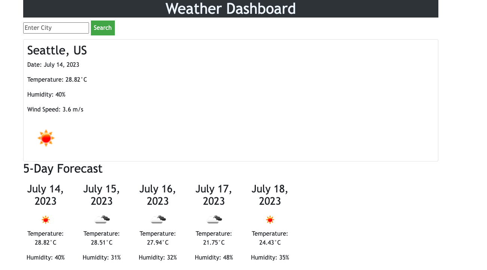

# Weather-Dashboard
06 Server-Side APIs

## Information
User Story of this project: 
To create a webpage that lets a user see the weather outlook (current + 5 day forecast) for multiple cities

## Description
This webpage allows users to search cities by name and be provided the current weather in the main container followed by the 5 day forecast along with the dates. The current forecast will provide the temperature, humidity, windspeed, and an icon detailing the weather. The webpage should allow a search history that a user may click on to review the forecast of that city again. 

## Usage 
No downloads are necessitated to utilize this weather dashboard. This is a deployed webpage application that may be used via any Web browser. 

## Links
You may access the deployed application at: 
https://shaffachaudhry.github.io/Weather-Dashboard/

you may access the repository at: 
https://github.com/shaffachaudhry/Weather-Dashboard

## Sources Utilized 
Multiple sources were used to help in the functionality of the website to include 
-Class Activities Module 6 Side Server API's\
https://coding-boot-camp.github.io/full-stack/apis/how-to-use-api-keys \
https://developer.mozilla.org/en-US/docs/Web/JavaScript/Reference/Global_Objects/Array/slice \
https://developer.mozilla.org/en-US/docs/Web/API/Element/tagName \ 
https://www.youtube.com/watch?v=cuEtnrL9-H0&ab_channel=WebDevSimplified \
https://developer.mozilla.org/en-US/docs/Web/API/Element/classList \
https://stackoverflow.com/questions/1531093/how-do-i-get-the-current-date-in-javascript \

## Mock Image
